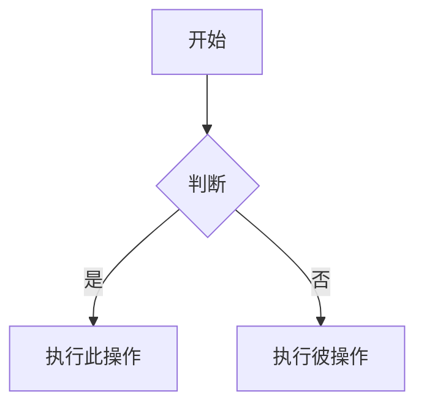
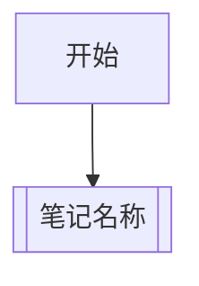

# Obsidian Flavored Markdown 笔记生成

生成符合 Obsidian 规范的 Markdown 内容。Obsidian 在 CommonMark 和 GFM 基础上扩展了 wikilinks、嵌入、callouts、属性、注释等语法。本 Skill 覆盖 Obsidian 特有扩展——标准 Markdown（标题、加粗、斜体、列表、引用、代码块、表格）视为已知知识。

## 笔记创建工作流

1. 在文件顶部添加 frontmatter 属性（title、tags、aliases 等）
2. 使用标准 Markdown 编写结构化内容，配合 Obsidian 特有语法
3. 使用 `[[Wikilink]]` 链接仓库内其他笔记，`[文本](URL)` 链接外部资源
4. 使用 `![[嵌入]]` 语法嵌入其他笔记、图片或 PDF 内容
5. 使用 `> [!type]` 语法添加 callout 提示框
6. 验证笔记在 Obsidian 阅读视图中正确渲染

选择链接方式的原则：仓库内笔记用 `[[wikilinks]]`（Obsidian 自动跟踪重命名），外部 URL 用 `[文本](URL)`。

## 内部链接（Wikilinks）

```
[[笔记名称]]                        链接到笔记
[[笔记名称|显示文本]]               自定义显示文本
[[笔记名称#标题]]                   链接到标题
[[笔记名称#^block-id]]              链接到块
[[#同笔记内标题]]                   同笔记内标题链接
```

### 块 ID 定义

在段落末尾添加 `^block-id` 使其可被链接：

```
这个段落可以被链接。 ^my-block-id
```

列表和引用的块 ID 放在块后的单独行：

```
> 一段引用

^quote-id
```

## 嵌入

在 wikilink 前加 `!` 即可嵌入内容：

```
![[笔记名称]]                       嵌入完整笔记
![[笔记名称#标题]]                  嵌入某个章节
![[image.png]]                      嵌入图片
![[image.png|300]]                  嵌入图片并指定宽度
![[document.pdf#page=3]]            嵌入 PDF 页面
![[audio.mp3]]                      嵌入音频
![[video.mp4]]                      嵌入视频
```

## Callouts

```
> [!note]
> 基本 callout。

> [!warning] 自定义标题
> 带自定义标题的 callout。

> [!faq]- 默认折叠
> 可折叠的 callout（- 折叠，+ 展开）。
```

### 内置类型

| 类型 | 别名 | 用途 |
|------|------|------|
| note | — | 一般备注 |
| abstract | summary, tldr | 摘要总结 |
| info | — | 信息提示 |
| todo | — | 待办事项 |
| tip | hint, important | 技巧建议 |
| success | check, done | 成功完成 |
| question | help, faq | 问题解答 |
| warning | caution, attention | 警告注意 |
| failure | fail, missing | 失败缺失 |
| danger | error | 危险错误 |
| bug | — | 缺陷问题 |
| example | — | 示例说明 |
| quote | cite | 引用 |

### 嵌套 Callout

```
> [!question] Callout 可以嵌套吗？
> > [!todo] 可以！
> > > [!example] 甚至可以多层嵌套。
```

## 属性（Frontmatter）

```yaml
---
title: 我的笔记
date: 2026-04-15
tags:
  - 项目
  - 进行中
aliases:
  - 备用名称
cssclasses:
  - custom-class
---
```

### 属性类型

| 类型 | 格式 | 示例 |
|------|------|------|
| Text | 单行文本 | `title: 笔记标题` |
| List | 多值列表 | `tags: [项目, 进行中]` |
| Number | 数字 | `priority: 1` |
| Checkbox | 布尔值 | `favorite: true` |
| Date | 日期 | `date: 2026-04-15` |
| Date & time | 日期时间 | `created: 2026-04-15T10:30:00` |
| Tags | 标签列表 | `tags: [项目/进行中]` |

### 属性中的内部链接

Text 和 List 属性中可以使用 `[[链接]]` 语法，但必须用引号包裹：

```yaml
link: "[[相关笔记]]"
links:
  - "[[笔记A]]"
  - "[[笔记B]]"
```

## 标签

```
#tag                    行内标签
#嵌套/标签             层级标签
```

标签规则：
- 可包含字母、数字（不能开头）、下划线、连字符、斜杠
- 也可在 frontmatter 的 `tags` 属性中定义
- 嵌套标签用 `/` 分隔，如 `#项目/进行中`

## 注释

```
这是可见内容 %%这是隐藏内容%% 文本。

%%
这整块内容在阅读视图中隐藏。
%%
```

## Obsidian 特有格式

### 高亮

```
==高亮文本==
```

### 数学公式（LaTeX）

```
行内公式：$e^{i\pi} + 1 = 0$

块级公式：
$$
\frac{a}{b} = c
$$
```

### 图表（Mermaid）



Mermaid 节点链接到 Obsidian 笔记：



### 脚注

```
正文中的脚注[^1]。

[^1]: 脚注内容。

行内脚注。^[这是行内脚注。]
```

### 任务列表

```
- [ ] 未完成任务
- [x] 已完成任务
- [-] 进行中的任务
- [?] 待确认的任务
```

## 完整示例

```markdown
---
title: 项目 Alpha
date: 2026-04-15
tags:
  - 项目
  - 进行中
status: 进行中
---

# 项目 Alpha

本项目旨在使用现代技术 [[改进工作流]]。

> [!important] 关键截止日期
> 第一个里程碑截止日期为 ==4月30日==。

## 任务

- [x] 初始规划
- [ ] 开发阶段
  - [ ] 后端实现
  - [ ] 前端设计

## 笔记

算法使用 $O(n \log n)$ 排序。详见 [[算法笔记#排序]]。

![[架构图.png|600]]

在 [[2026-04-10 会议纪要#决策]] 中评审。
```

## 生成笔记时的智能行为

1. **链接建议**：生成笔记前，先搜索仓库中已有笔记，建议建立双向链接
   ```bash
   obsidian search query="相关主题" limit=5
   obsidian backlinks file="相关笔记"
   ```

2. **模板感知**：生成笔记前先检查仓库模板
   ```bash
   obsidian templates
   obsidian template:read name="模板名称"
   ```

3. **标签一致性**：生成标签前先查看仓库已有标签
   ```bash
   obsidian tags counts
   ```

4. **属性规范**：设置属性时使用 CLI 确保类型验证
   ```bash
   obsidian property:set name="status" value="进行中" type=text file="目标笔记"
   ```